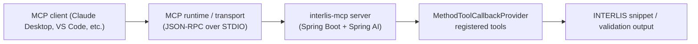

# interlis-mcp

`interlis-mcp` is a [Model Context Protocol (MCP)](https://modelcontextprotocol.io) server that helps large language models author correct INTERLIS 2 model definitions. It exposes a catalogue of Spring AI tools for building model, topic, domain, class, association, structure, attribute, constraint, and identifier snippets that IDE assistants can assemble into complete schemas.

## Overview
- ✅ STDIO-based MCP server built with Spring Boot and Spring AI's MCP starter.
- ✅ Tooling focused on generating valid INTERLIS snippets and validating identifiers.
- ✅ Ready to plug into Claude Desktop, VS Code MCP clients, or any MCP-compliant agent runtime.

## Architecture at a glance


## Quick start

### Run from source
1. Ensure a JDK 21 runtime is available (the Gradle build configures the Java toolchain accordingly).
2. Build the application:
   ```bash
   ./gradlew bootJar
   ```
3. Start the MCP server with STDIO transport:
   ```bash
   java -jar build/libs/interlis-mcp.jar
   ```
   The process remains attached to your terminal because MCP communicates via STDIN/STDOUT.

### Docker
Build the container image locally:

```bash
docker build -t interlis-mcp .
```

Run the MCP server with standard input/output connected to your host:

```bash
docker run --rm -i interlis-mcp
```

Because the MCP transport is STDIO-based you should not allocate a TTY (no `-t`) and must keep standard input open (the `-i` flag). For Docker Compose set `stdin_open: true` and `tty: false` on the service so that tools can exchange JSON-RPC messages with the server without any extra escape sequences.

## Connect from MCP clients
- **Claude Desktop** – register the executable or Docker command under *Settings → Developer → MCP tools*. Detailed steps are documented in [docs/USER_GUIDE.md](docs/USER_GUIDE.md#claude-desktop).
- **VS Code** – add the server command to the Model Context Protocol extension settings (see [docs/USER_GUIDE.md](docs/USER_GUIDE.md#visual-studio-code)).

## Documentation
- [User Guide](docs/USER_GUIDE.md) – startup instructions, client configuration, and a complete tool reference.
- [Developer Guide](docs/DEVELOPER_GUIDE.md) – build, test, and extension notes for contributors.

## License
[MIT](LICENSE)
